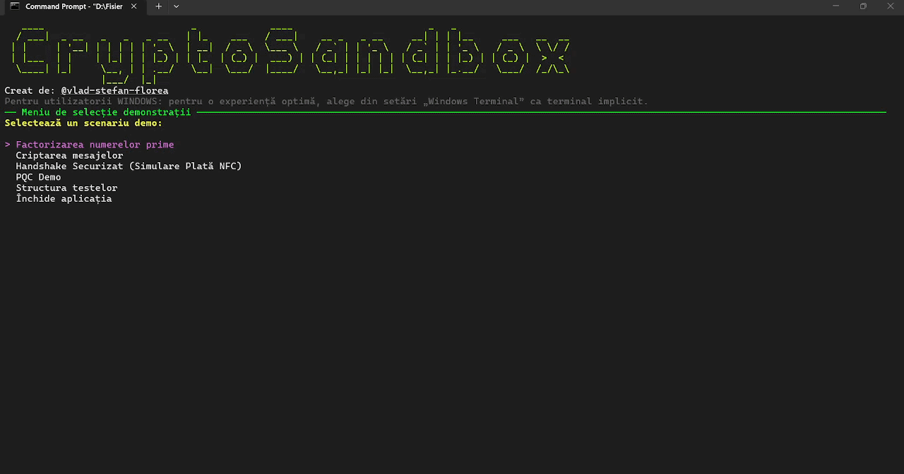
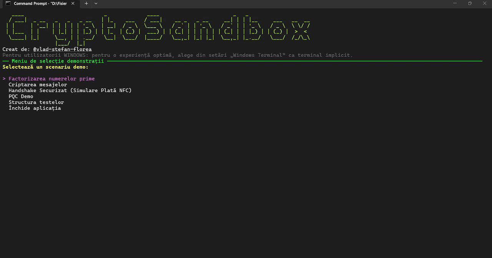

# CryptoSandbox

**CryptoSandbox** este un laborator digital interactiv creat pentru explorarea și înțelegerea algoritmilor de criptare. Proiectul folosește o interfață modernă în consolă (Spectre.Console) pentru a vizualiza procese matematice care, în mod normal, rămân invizibile.

## Funcții Principale

- **Modul Hashing:** Testează algoritmi precum MD5, SHA-256 și SHA-512. Observă "Efectul de Avalanșă" și verifică integritatea fișierelor locale (până la 100MB).
- **Criptografie simetrică și asimetrică:** Generare de perechi de chei, semnare digitală și verificare, prin algoritmi ca **AES** și **RSA**.
- **Simulare plată NFC:** Simularea simplificată a unei tranzacții prin NFC între un telefon și un POS.
- **LWE (Learning With Errors):** Experimentează bazele criptografiei post-cuantice. Încearcă să găsești "secretul" într-o matrice plină de zgomot matematic.
- **Brute-Force Simulator:** Vizualizare grafică a modului în care un atacator încearcă să spargă o cheie și de ce complexitatea spațiului de căutare face acest lucru imposibil în criptografia modernă.

## Tehnologii folosite

- **Limbaj:** C# (.NET 10)
- **UI:** [Spectre.Console](https://spectreconsole.net/) pentru randare grafică, tabele și animații.
- **Securitate:** `System.Security.Cryptography` pentru implementări standard.

## Demonstrații
### RSA
<p align="center">
  
</p>

### Hashing
<p align="center">
  
</p>

### LWE
<p align="center">
  
</p>

## Instalare și Rulare

1. Clonează repo-ul:

   ```bash
   git clone https://github.com/vlad-stefan-florea/CryptoSandboxRO
   ```

2. Accesează directorul proiectului:

   ```bash
   cd CryptoSandboxRO
   ```

3. Rulează aplicația

   ```bash
   dotnet run
   ```

## Notă privind Securitatea

Acest proiect are scop strict educațional. Deși folosește biblioteci de securitate standard, este conceput pentru a demonstra concepte, nu pentru a fi utilizat pentru protejarea datelor sensibile.
